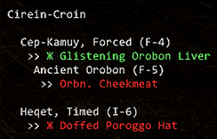
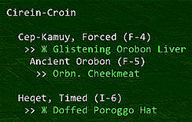

# FFXI Empy Pop Tracker

An FFXI Windower 4 addon that tracks items and key items for popping various NMs, such as Briareus, Apademak and Warder of Courage.

 

Originally developed to track Abyssea Empyrean weapon NMs, hence the name. Key items are identified by the Zhe (Ж) character. Treasure pool counts for pop items are listed in amber after the item in the format of [3] (assuming 3 of that item in the pool).

All text colours are configurable via the auto-generated settings.xml file.

## Installation

Empy Pop Tracker is now available via the Windower 4 addons list.

## Load

`//lua load empypoptracker`

Note: You won't have to do this if you obtained this addon via Windower.

## Track an NM

`//ept track glavoid` tracks Glavoid pop items/key items.

You can also track an NM by using a wildcard pattern, because fuck having to remember how to spell Itzpapalotl:

`//ept track itz*`

For a full list of trackable NMs, see the nms directory or use the `list` command (see below).

## Other Commands

### List Trackable NMs

`//ept list`

### Open BG Wiki for NM

`//ept bg`

### Hide UI

`//ept hide`

### Show UI

`//ept show`

### Toggle Mini Mode

`//ept mini`

### Toggle Collectable Item Display

`//ept collectables`

### Display Help

`//ept help`

## Where is Fistule?

Fistule is a unique NM when compared to the others. It does not require KIs that can be tracked, so it isn't included with the addon.

## Contributing

If there's an NM you want to have added, or if you notice something not quite right, please [raise an issue](https://github.com/xurion/ffxi-empy-pop-tracker/issues).

Or better yet, [pull requests](https://github.com/xurion/ffxi-empy-pop-tracker/pulls) are welcome!
